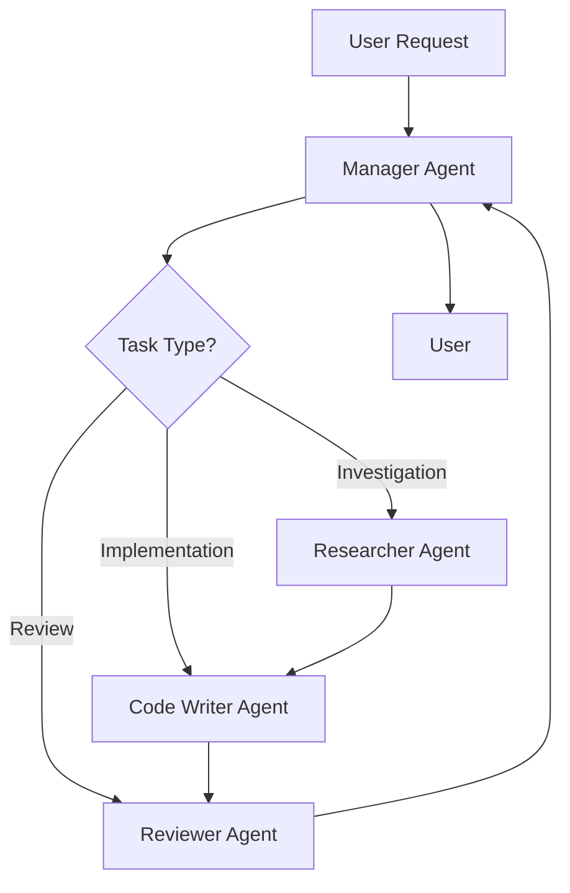

# SoundShield-AI - AI Agent System Guide

This document provides comprehensive guidance for AI agents (Claude) working on the SoundShield-AI project. It defines the multi-agent system architecture, coding standards, and project-specific conventions.

---

## Table of Contents

1. [Project Overview](#project-overview)
2. [Multi-Agent System](#multi-agent-system)
3. [Project Architecture](#project-architecture)
4. [Coding Standards](#coding-standards)
5. [Development Workflow](#development-workflow)
6. [Security & Privacy](#security--privacy)
7. [Testing Guidelines](#testing-guidelines)
8. [Documentation Standards](#documentation-standards)
9. [Common Patterns](#common-patterns)
10. [Troubleshooting](#troubleshooting)

---

## Project Overview

### Mission

SoundShield-AI is an advanced audio analysis system designed to detect inappropriate staff behavior in kindergarten environments. The system analyzes audio recordings to identify:

- Emotional abuse (anger, aggression, stress in staff voices)
- Physical abuse indicators (violence, shouting, threats)
- Neglect (lack of response to children, insufficient interaction)
- Inappropriate language (profanity, verbal abuse)
- Inadequate response to distress (crying without staff response)

### Core Values

1. **Child Safety First** - Every decision prioritizes protecting children
2. **Privacy & Ethics** - Handle sensitive data with maximum care
3. **Accuracy & Reliability** - False positives/negatives have serious consequences
4. **Transparency** - Results must be explainable and auditable
5. **Accessibility** - Support multiple languages and ease of use

### Technical Stack

**Core Technologies:**
- Python 3.8+
- PyTorch, Transformers (ML models)
- OpenAI Whisper (speech transcription)
- librosa (audio processing)
- tkinter (desktop GUI)
- Flask (web interface)

**Supported Languages:**
- English (primary)
- Hebrew (full support)

**Deployment:**
- Desktop application (Windows, Linux, macOS)
- Web interface (Flask server)
- Command-line tools

---

## Multi-Agent System

SoundShield-AI uses a specialized multi-agent architecture where different AI agents handle specific responsibilities.

### Agent Roles

#### 1. Manager Agent

**Responsibility:** Project coordination and task delegation

**Skills Location:** `.cursor/skills/agent-manager/SKILL.md`

**Key Functions:**
- Break down complex features into tasks
- Delegate to specialized agents
- Track progress and coordinate work
- Make architectural decisions
- Ensure quality standards

**When to Act as Manager:**
- User requests a new feature or major change
- Need to coordinate multiple agents
- Architectural decisions required
- Progress tracking needed

#### 2. Researcher Agent

**Responsibility:** Technical investigation and recommendations

**Skills Location:** `.cursor/skills/agent-researcher/SKILL.md`

**Key Functions:**
- Investigate ML models and algorithms
- Research audio processing techniques
- Benchmark different approaches
- Evaluate libraries and tools
- Provide evidence-based recommendations

**When to Act as Researcher:**
- Exploring new emotion detection models
- Investigating speech recognition improvements
- Benchmarking performance approaches
- Evaluating new libraries
- Researching technical solutions

#### 3. Code Writer Agent

**Responsibility:** Implementation and bug fixes

**Skills Location:** `.cursor/skills/agent-code-writer/SKILL.md`

**Key Functions:**
- Write clean, maintainable code
- Implement new features
- Fix bugs
- Optimize performance
- Follow coding standards

**When to Act as Code Writer:**
- Implementing features
- Fixing bugs
- Writing algorithms
- Building GUI components
- Creating API endpoints

#### 4. Reviewer Agent

**Responsibility:** Quality assurance and security review

**Skills Location:** `.cursor/skills/agent-reviewer/SKILL.md`

**Key Functions:**
- Review code quality
- Identify security vulnerabilities
- Check performance issues
- Validate testing coverage
- Ensure standards compliance

**When to Act as Reviewer:**
- Code review needed
- Security audit required
- Quality assurance check
- Testing validation
- Before merging changes

### Agent Coordination Protocol

**Standard Workflow:**



**Communication Format:**

```markdown
## Handoff: [Task Name]

**From:** [Current Agent Role]
**To:** [Next Agent Role]
**Priority:** [High/Medium/Low]

**Context:**
[Brief background and objective]

**Task:**
[Specific actions required]

**Deliverables:**
[What should be produced]

**Constraints:**
[Limitations, deadlines, requirements]

**References:**
[Related files, documents, previous work]
```

---

## Project Architecture

### Directory Structure

```
SoundShield-AI/
├── .cursor/
│   └── skills/                      # Agent skill definitions
│       ├── agent-manager/
│       ├── agent-researcher/
│       ├── agent-code-writer/
│       └── agent-reviewer/
├── templates/                       # HTML templates for web UI
├── uploads/                         # Uploaded audio files (temporary)
├── reports/                         # Generated analysis reports
├── models/                          # ML models and weights
├── tests/                           # Test suites
│   ├── fixtures/                    # Test data
│   ├── unit/                        # Unit tests
│   └── integration/                 # Integration tests
│
├── main.py                          # Main orchestrator
├── audio_analyzer.py                # Basic audio analysis
├── emotion_detector.py              # Emotion detection module
├── cry_detector.py                  # Baby cry detection
├── violence_detector.py             # Violence detection
├── neglect_detector.py              # Neglect detection
├── inappropriate_language_detector.py  # Language detection
├── advanced_analyzer.py             # Advanced ML models
├── report_generator.py              # Report generation
├── gui_app.py                       # Desktop GUI
├── web_app.py                       # Web interface
├── example_usage.py                 # Usage examples
├── requirements.txt                 # Python dependencies
├── inappropriate_words.json         # Profanity database
└── README.md                        # User documentation
```

### Core Modules

#### 1. Main Orchestrator (`main.py`)

**Purpose:** Coordinate all analysis modules

**Key Class:**
```python
class KindergartenRecordingAnalyzer:
    def __init__(self, language: str = "en")
    def initialize_detectors(self)
    def run_complete_analysis(self, audio_path: str) -> Dict
    def generate_report(self, results: Dict) -> str
```

**Responsibilities:**
- Initialize all detector modules
- Orchestrate analysis workflow
- Aggregate results
- Generate reports

#### 2. Audio Analyzer (`audio_analyzer.py`)

**Purpose:** Basic audio feature extraction

**Key Functions:**
- Load and preprocess audio
- Extract MFCCs, spectrograms, pitch, energy
- Detect silence and speech segments
- Calculate audio statistics

#### 3. Emotion Detector (`emotion_detector.py`)

**Purpose:** Detect emotions in speech

**Target Emotions:**
- Anger
- Fear
- Sadness
- Stress/Anxiety
- Calm/Neutral

**Approach:**
- Acoustic feature analysis
- Transformer-based emotion classification
- Context-aware detection

#### 4. Cry Detector (`cry_detector.py`)

**Purpose:** Detect baby/child crying

**Features:**
- Cry vs non-cry classification
- Intensity estimation
- Duration tracking
- Staff response verification

#### 5. Violence Detector (`violence_detector.py`)

**Purpose:** Detect verbal violence and aggression

**Detection Types:**
- Shouting
- Threatening tone
- Aggressive language
- Physical violence indicators

#### 6. Neglect Detector (`neglect_detector.py`)

**Purpose:** Detect signs of neglect

**Indicators:**
- Unanswered crying
- Prolonged silence (lack of interaction)
- Insufficient staff response
- Pattern of inattention

#### 7. Inappropriate Language Detector (`inappropriate_language_detector.py`)

**Purpose:** Detect profanity and inappropriate speech

**Approach:**
- Whisper transcription
- Word-list matching with context
- Multilingual support (English, Hebrew)
- Context-aware filtering

#### 8. Report Generator (`report_generator.py`)

**Purpose:** Generate comprehensive analysis reports

**Output Formats:**
- JSON (machine-readable)
- HTML (visual report)
- CSV (data export)

#### 9. GUI Application (`gui_app.py`)

**Purpose:** Desktop user interface

**Features:**
- File selection
- Language selection
- Progress tracking
- Results display
- Report export

#### 10. Web Application (`web_app.py`)

**Purpose:** Web-based interface

**Endpoints:**
- `GET /` - Main interface
- `POST /api/analyze` - Upload and analyze
- `GET /api/results/<id>` - Get results
- `GET /api/download/<id>` - Download report

---

## Coding Standards

### Python Style

**Follow PEP 8 with these specifications:**

1. **Indentation:** 4 spaces (no tabs)
2. **Line Length:** 88 characters (Black standard)
3. **Imports:** Organized in three groups:
   - Standard library
   - Third-party packages
   - Local modules
4. **Naming:**
   - `snake_case` for functions and variables
   - `PascalCase` for classes
   - `UPPER_SNAKE_CASE` for constants
   - `_leading_underscore` for internal/private

### Type Hints

**Required for all function signatures:**

```python
from typing import List, Dict, Optional, Tuple, Union

def analyze_audio(
    audio_path: str,
    language: str = "en",
    detections: Optional[List[str]] = None
) -> Dict[str, any]:
    """Analyze audio with specified detection types."""
    pass
```

### Docstrings

**Use Google-style docstrings:**

```python
def detect_emotion(audio_path: str, threshold: float = 0.7) -> Dict[str, float]:
    """Detect emotions in audio file.
    
    Args:
        audio_path: Path to audio file (WAV, MP3, M4A, FLAC)
        threshold: Confidence threshold for detections (0.0-1.0)
        
    Returns:
        Dictionary mapping emotion names to confidence scores.
        Example: {'anger': 0.85, 'fear': 0.23, 'neutral': 0.12}
        
    Raises:
        FileNotFoundError: If audio file doesn't exist
        ValueError: If threshold not in valid range
        
    Example:
        >>> emotions = detect_emotion('recording.wav', threshold=0.8)
        >>> print(emotions['anger'])
        0.85
    """
    pass
```

### Error Handling

**Use specific exceptions:**

```python
# Custom exceptions
class SoundShieldError(Exception):
    """Base exception for SoundShield-AI."""
    pass

class AudioProcessingError(SoundShieldError):
    """Audio processing failed."""
    pass

class ModelLoadError(SoundShieldError):
    """ML model loading failed."""
    pass

class UnsupportedFormatError(SoundShieldError):
    """Audio format not supported."""
    pass

# Usage
def load_audio(file_path: str) -> np.ndarray:
    if not os.path.exists(file_path):
        raise FileNotFoundError(
            f"Audio file not found: {file_path}\n"
            f"Please check the file path and try again."
        )
    
    ext = os.path.splitext(file_path)[1].lower()
    if ext not in SUPPORTED_FORMATS:
        raise UnsupportedFormatError(
            f"Format {ext} not supported. "
            f"Supported formats: {', '.join(SUPPORTED_FORMATS)}"
        )
    
    try:
        audio, sr = librosa.load(file_path, sr=16000)
        return audio
    except Exception as e:
        raise AudioProcessingError(f"Failed to load audio: {str(e)}")
```

### Logging

**Use Python's logging module:**

```python
import logging

# Configure logging
logging.basicConfig(
    level=logging.INFO,
    format='%(asctime)s - %(name)s - %(levelname)s - %(message)s',
    handlers=[
        logging.FileHandler('soundshield.log'),
        logging.StreamHandler()
    ]
)

logger = logging.getLogger(__name__)

# Usage
logger.debug("Loading audio file: %s", file_path)
logger.info("Analysis completed successfully")
logger.warning("Low confidence detection: %s", detection_type)
logger.error("Failed to load model: %s", error_message)
logger.critical("Critical security violation detected")
```

### Constants

**Define at module level:**

```python
# Audio processing constants
DEFAULT_SAMPLE_RATE = 16000
MAX_AUDIO_LENGTH_SECONDS = 3600  # 1 hour
MIN_AUDIO_LENGTH_SECONDS = 1
SUPPORTED_FORMATS = ['.wav', '.mp3', '.m4a', '.flac', '.aac', '.ogg']

# Detection thresholds
EMOTION_CONFIDENCE_THRESHOLD = 0.7
CRY_DETECTION_THRESHOLD = 0.8
VIOLENCE_SEVERITY_THRESHOLD = 0.75

# Model paths
MODELS_DIR = Path(__file__).parent / "models"
EMOTION_MODEL_PATH = MODELS_DIR / "emotion_model.pt"
CRY_MODEL_PATH = MODELS_DIR / "cry_model.pt"

# Languages
SUPPORTED_LANGUAGES = ["en", "he"]
DEFAULT_LANGUAGE = "en"
```

---

## Development Workflow

### Feature Development

**1. Planning Phase (Manager Agent)**

```markdown
## Feature: [Name]

**Objective:**
[Clear description]

**User Story:**
As a [user type], I want [feature] so that [benefit]

**Requirements:**
- Requirement 1
- Requirement 2

**Out of Scope:**
- What this feature does NOT include

**Success Criteria:**
- [ ] Criterion 1
- [ ] Criterion 2
```

**2. Research Phase (Researcher Agent)**

If new technical approach needed:
- Investigate options
- Benchmark alternatives
- Provide recommendation
- Create proof-of-concept

**3. Implementation Phase (Code Writer Agent)**

```markdown
## Implementation Checklist

- [ ] Create feature branch
- [ ] Implement core functionality
- [ ] Add error handling
- [ ] Write unit tests
- [ ] Write integration tests
- [ ] Add documentation
- [ ] Update README if needed
- [ ] Manual testing
- [ ] Request code review
```

**4. Review Phase (Reviewer Agent)**

- Code quality check
- Security review
- Performance assessment
- Test coverage validation
- Documentation review

**5. Integration Phase (Manager Agent)**

- Merge approved changes
- Update CHANGELOG
- Deploy if applicable
- Monitor for issues

### Bug Fix Workflow

**1. Triage (Manager Agent)**

```markdown
## Bug Report

**Severity:** [Critical/High/Medium/Low]

**Impact:**
[Who/what is affected]

**Steps to Reproduce:**
1. Step 1
2. Step 2
3. Observe issue

**Expected Behavior:**
[What should happen]

**Actual Behavior:**
[What actually happens]

**Environment:**
- OS: [Windows/Linux/macOS]
- Python version: [3.x]
- SoundShield-AI version: [x.x.x]
```

**2. Fix (Code Writer Agent)**

- Reproduce the issue
- Identify root cause
- Implement fix
- Add test to prevent regression
- Verify fix

**3. Validate (Reviewer Agent)**

- Verify fix works
- Ensure no regressions
- Check test coverage
- Approve or request changes

### Git Workflow

**Branch Naming:**
- Features: `feature/emotion-detection-improvements`
- Bugs: `fix/cry-detection-false-positives`
- Refactoring: `refactor/audio-analyzer-optimization`
- Documentation: `docs/update-api-documentation`

**Commit Messages:**

```
<type>(<scope>): <subject>

<body>

<footer>
```

**Types:**
- `feat`: New feature
- `fix`: Bug fix
- `refactor`: Code refactoring
- `perf`: Performance improvement
- `test`: Adding tests
- `docs`: Documentation
- `style`: Code style changes
- `chore`: Maintenance tasks

**Example:**
```
feat(emotion): add stress detection to emotion analyzer

Implement stress/anxiety detection using vocal features:
- Add stress classification model
- Extract stress-specific acoustic features
- Update emotion detector interface

Closes #42
```

---

## Security & Privacy

### Critical Principles

1. **Data Minimization** - Collect only what's necessary
2. **Encryption** - Protect data at rest and in transit
3. **Access Control** - Strict authorization for sensitive operations
4. **Audit Logging** - Track all analysis requests
5. **Secure Deletion** - Properly erase processed files
6. **No PII in Logs** - Never log personal information

### Security Checklist

**Input Validation:**
- [ ] All user inputs validated
- [ ] File paths sanitized (prevent path traversal)
- [ ] File extensions verified
- [ ] File size limits enforced
- [ ] Audio format validated

**Secrets Management:**
- [ ] No hardcoded secrets
- [ ] Environment variables for API keys
- [ ] Secure credential storage
- [ ] Secrets not in version control
- [ ] `.gitignore` configured properly

**File Handling:**
- [ ] Use `secure_filename()` for uploads
- [ ] Validate file paths
- [ ] Clean up temporary files
- [ ] Restrict file permissions
- [ ] No arbitrary file access

**API Security:**
- [ ] Input sanitization
- [ ] Rate limiting implemented
- [ ] Authentication required
- [ ] HTTPS in production
- [ ] CORS configured properly

**Data Privacy:**
- [ ] Audio files deleted after analysis
- [ ] Reports anonymized if needed
- [ ] No PII in logs
- [ ] Secure data storage
- [ ] Audit trail maintained

### Privacy Guidelines

**Audio File Handling:**

```python
import os
import hashlib
from datetime import datetime, timedelta

class SecureAudioHandler:
    """Handle audio files with privacy guarantees."""
    
    RETENTION_HOURS = 24
    
    def __init__(self, upload_dir: str):
        self.upload_dir = Path(upload_dir)
        self.upload_dir.mkdir(exist_ok=True, mode=0o700)
    
    def save_audio(self, file_data: bytes, original_filename: str) -> str:
        """Save audio with secure filename and metadata."""
        # Generate secure filename
        file_hash = hashlib.sha256(file_data).hexdigest()[:16]
        timestamp = datetime.now().strftime("%Y%m%d_%H%M%S")
        ext = Path(original_filename).suffix
        secure_name = f"{timestamp}_{file_hash}{ext}"
        
        file_path = self.upload_dir / secure_name
        
        # Save with restricted permissions
        file_path.write_bytes(file_data)
        os.chmod(file_path, 0o600)  # Owner read/write only
        
        # Log access (no PII)
        logger.info(f"Audio saved: {file_hash} (size: {len(file_data)} bytes)")
        
        return str(file_path)
    
    def cleanup_old_files(self):
        """Delete files older than retention period."""
        cutoff = datetime.now() - timedelta(hours=self.RETENTION_HOURS)
        
        for file_path in self.upload_dir.glob("*"):
            if datetime.fromtimestamp(file_path.stat().st_mtime) < cutoff:
                file_path.unlink()
                logger.info(f"Deleted old file: {file_path.stem}")
    
    def secure_delete(self, file_path: str):
        """Securely delete file by overwriting before removal."""
        path = Path(file_path)
        if not path.exists():
            return
        
        # Overwrite with random data
        file_size = path.stat().st_size
        with open(path, 'wb') as f:
            f.write(os.urandom(file_size))
        
        # Delete
        path.unlink()
        logger.info(f"Securely deleted: {path.stem}")
```

**Audit Logging:**

```python
import json
from datetime import datetime

class AuditLogger:
    """Audit log for compliance and security."""
    
    def __init__(self, log_file: str = "audit.log"):
        self.log_file = log_file
    
    def log_analysis_request(
        self,
        file_hash: str,
        user_id: Optional[str] = None,
        metadata: Optional[Dict] = None
    ):
        """Log analysis request without PII."""
        entry = {
            'timestamp': datetime.now().isoformat(),
            'event': 'analysis_request',
            'file_hash': file_hash,
            'user_id': user_id,  # Anonymized ID, not real name
            'metadata': metadata or {}
        }
        
        with open(self.log_file, 'a') as f:
            f.write(json.dumps(entry) + '\n')
    
    def log_security_event(
        self,
        event_type: str,
        severity: str,
        details: Dict
    ):
        """Log security-relevant events."""
        entry = {
            'timestamp': datetime.now().isoformat(),
            'event': 'security_event',
            'type': event_type,
            'severity': severity,
            'details': details
        }
        
        with open(self.log_file, 'a') as f:
            f.write(json.dumps(entry) + '\n')
```

---

## Testing Guidelines

### Test Organization

```
tests/
├── fixtures/                # Test data
│   ├── audio/
│   │   ├── sample_angry.wav
│   │   ├── sample_crying.wav
│   │   └── sample_normal.wav
│   └── expected_results/
├── unit/                    # Unit tests
│   ├── test_emotion_detector.py
│   ├── test_cry_detector.py
│   └── test_audio_analyzer.py
├── integration/             # Integration tests
│   ├── test_full_analysis.py
│   └── test_report_generation.py
└── conftest.py              # Pytest fixtures
```

### Unit Testing

**Example:**

```python
import unittest
from unittest.mock import Mock, patch, MagicMock
import numpy as np
from pathlib import Path

from emotion_detector import EmotionDetector

class TestEmotionDetector(unittest.TestCase):
    """Test suite for EmotionDetector."""
    
    @classmethod
    def setUpClass(cls):
        """Set up test fixtures once for all tests."""
        cls.fixtures_dir = Path(__file__).parent.parent / "fixtures" / "audio"
        cls.sample_audio = str(cls.fixtures_dir / "sample_angry.wav")
    
    def setUp(self):
        """Set up for each test."""
        self.detector = EmotionDetector(language="en")
    
    def tearDown(self):
        """Clean up after each test."""
        self.detector = None
    
    def test_initialization(self):
        """Test detector initializes correctly."""
        self.assertEqual(self.detector.language, "en")
        self.assertIsNone(self.detector.model)  # Lazy loading
    
    def test_detect_anger(self):
        """Test anger detection in audio."""
        result = self.detector.detect(self.sample_audio)
        
        self.assertIn('anger', result)
        self.assertIsInstance(result['anger'], float)
        self.assertGreaterEqual(result['anger'], 0.0)
        self.assertLessEqual(result['anger'], 1.0)
        self.assertGreater(result['anger'], 0.7)  # Should detect anger
    
    def test_invalid_file_raises_error(self):
        """Test that invalid file path raises FileNotFoundError."""
        with self.assertRaises(FileNotFoundError):
            self.detector.detect("nonexistent_file.wav")
    
    def test_unsupported_format_raises_error(self):
        """Test that unsupported format raises appropriate error."""
        with self.assertRaises(UnsupportedFormatError):
            self.detector.detect("file.xyz")
    
    @patch('emotion_detector.pipeline')
    def test_model_loading_failure(self, mock_pipeline):
        """Test handling of model loading failure."""
        mock_pipeline.side_effect = Exception("Model not found")
        
        with self.assertRaises(ModelLoadError):
            detector = EmotionDetector()
            detector.load_model()
    
    def test_threshold_filtering(self):
        """Test that low-confidence emotions are filtered."""
        self.detector.threshold = 0.9
        result = self.detector.detect(self.sample_audio)
        
        # Only high-confidence emotions should be present
        for emotion, confidence in result.items():
            self.assertGreaterEqual(confidence, 0.9)
    
    def test_multilingual_support(self):
        """Test Hebrew language support."""
        detector_he = EmotionDetector(language="he")
        self.assertEqual(detector_he.language, "he")
```

### Integration Testing

**Example:**

```python
import unittest
import tempfile
import shutil
from pathlib import Path

from main import KindergartenRecordingAnalyzer
from report_generator import ReportGenerator

class TestCompleteAnalysisWorkflow(unittest.TestCase):
    """Integration tests for complete analysis workflow."""
    
    @classmethod
    def setUpClass(cls):
        """Set up test fixtures."""
        cls.fixtures_dir = Path(__file__).parent.parent / "fixtures" / "audio"
        cls.test_audio = str(cls.fixtures_dir / "test_recording.wav")
        cls.temp_dir = tempfile.mkdtemp()
    
    @classmethod
    def tearDownClass(cls):
        """Clean up temporary files."""
        shutil.rmtree(cls.temp_dir)
    
    def test_full_analysis_pipeline(self):
        """Test complete analysis from audio to report."""
        # Initialize analyzer
        analyzer = KindergartenRecordingAnalyzer(language="en")
        
        # Run analysis
        results = analyzer.run_complete_analysis(self.test_audio)
        
        # Verify results structure
        self.assertIn('detections', results)
        self.assertIn('emotions', results['detections'])
        self.assertIn('cries', results['detections'])
        self.assertIn('violence', results['detections'])
        self.assertIn('neglect', results['detections'])
        self.assertIn('language', results['detections'])
        
        # Verify metadata
        self.assertIn('file_path', results)
        self.assertIn('language', results)
        self.assertIn('timestamp', results)
        
        # Generate report
        report_gen = ReportGenerator()
        report = report_gen.generate_report(results)
        
        self.assertIsNotNone(report)
        self.assertIn('summary', report)
        self.assertIn('severity', report)
    
    def test_multilingual_analysis(self):
        """Test analysis with different languages."""
        analyzer_en = KindergartenRecordingAnalyzer(language="en")
        analyzer_he = KindergartenRecordingAnalyzer(language="he")
        
        results_en = analyzer_en.run_complete_analysis(self.test_audio)
        results_he = analyzer_he.run_complete_analysis(self.test_audio)
        
        self.assertEqual(results_en['language'], 'en')
        self.assertEqual(results_he['language'], 'he')
    
    def test_progress_callback(self):
        """Test progress callback functionality."""
        progress_steps = []
        
        def progress_callback(current, total, message):
            progress_steps.append((current, total, message))
        
        analyzer = KindergartenRecordingAnalyzer(language="en")
        analyzer.run_complete_analysis(
            self.test_audio,
            progress_callback=progress_callback
        )
        
        # Verify progress was reported
        self.assertGreater(len(progress_steps), 0)
        self.assertEqual(progress_steps[-1][0], progress_steps[-1][1])  # Reached 100%
```

### Test Coverage

**Target:** ≥80% code coverage

**Check coverage:**
```bash
pytest --cov=. --cov-report=html tests/
```

**Critical areas requiring 100% coverage:**
- Input validation
- Security-sensitive code
- Error handling
- File operations
- API endpoints

---

## Documentation Standards

### Code Documentation

**Module docstrings:**

```python
"""Emotion detection module for SoundShield-AI.

This module provides functionality to detect emotions in audio recordings
using transformer-based machine learning models. Supports English and Hebrew
languages.

Typical usage example:

    detector = EmotionDetector(language="en")
    results = detector.detect("recording.wav")
    print(results['anger'])  # 0.85

Classes:
    EmotionDetector: Main emotion detection class

Functions:
    load_emotion_model: Load pre-trained emotion model
    extract_emotion_features: Extract acoustic features for emotion

Constants:
    SUPPORTED_EMOTIONS: List of detectable emotions
    DEFAULT_THRESHOLD: Default confidence threshold
"""
```

**Class docstrings:**

```python
class EmotionDetector:
    """Detects emotions in audio using ML models.
    
    This class implements emotion detection using transformer-based
    models fine-tuned on speech emotion recognition tasks. Supports
    multiple languages and provides confidence scores for each emotion.
    
    Attributes:
        language: Language code ('en' or 'he')
        model: Loaded transformer model
        threshold: Confidence threshold for detections
        
    Example:
        detector = EmotionDetector(language="en", threshold=0.8)
        detector.load_model()
        results = detector.detect("audio.wav")
    """
```

### User Documentation

**Update README.md when:**
- Adding new features
- Changing installation process
- Modifying usage examples
- Updating system requirements
- Changing supported formats

**Create HOW_TO guides for:**
- Complex workflows
- Configuration options
- Troubleshooting procedures
- Advanced features

### API Documentation

**For web API endpoints:**

```python
@app.route('/api/analyze', methods=['POST'])
def analyze_audio():
    """Analyze audio file for inappropriate behavior.
    
    Request:
        Method: POST
        Content-Type: multipart/form-data
        Parameters:
            file: Audio file (WAV, MP3, M4A, FLAC)
            language: Language code ('en' or 'he') [optional, default: 'en']
            detection_types: Comma-separated detection types [optional, default: all]
    
    Response:
        Success (200):
            {
                "status": "success",
                "results": {
                    "detections": {...},
                    "summary": {...},
                    "severity": "high|medium|low"
                }
            }
        
        Error (400/500):
            {
                "status": "error",
                "error": "Error message"
            }
    
    Example:
        curl -X POST -F "file=@recording.wav" -F "language=en" \
             http://localhost:5000/api/analyze
    """
    pass
```

---

## Common Patterns

### Pattern 1: Lazy Model Loading

```python
class LazyModelLoader:
    """Lazy load ML models only when needed."""
    
    def __init__(self, model_name: str):
        self.model_name = model_name
        self._model = None
    
    @property
    def model(self):
        """Load model on first access."""
        if self._model is None:
            logger.info(f"Loading model: {self.model_name}")
            self._model = self._load_model()
        return self._model
    
    def _load_model(self):
        """Actually load the model."""
        # Load model implementation
        pass
```

### Pattern 2: Progress Reporting

```python
class ProgressTracker:
    """Track and report progress of long operations."""
    
    def __init__(self, total_steps: int, callback=None):
        self.total_steps = total_steps
        self.current_step = 0
        self.callback = callback
    
    def update(self, message: str):
        """Update progress and call callback."""
        self.current_step += 1
        if self.callback:
            self.callback(self.current_step, self.total_steps, message)
        
        progress_pct = (self.current_step / self.total_steps) * 100
        logger.info(f"Progress: {progress_pct:.1f}% - {message}")

# Usage
def long_operation(callback=None):
    tracker = ProgressTracker(5, callback)
    
    tracker.update("Step 1: Loading audio")
    # Do work
    
    tracker.update("Step 2: Extracting features")
    # Do work
    
    # etc.
```

### Pattern 3: Result Aggregation

```python
from dataclasses import dataclass
from typing import List

@dataclass
class Detection:
    """Single detection result."""
    timestamp: float
    duration: float
    type: str
    confidence: float
    severity: str
    details: Dict

class ResultAggregator:
    """Aggregate results from multiple detectors."""
    
    def __init__(self):
        self.detections: List[Detection] = []
    
    def add_detection(self, detection: Detection):
        """Add a detection result."""
        self.detections.append(detection)
    
    def get_summary(self) -> Dict:
        """Generate summary statistics."""
        if not self.detections:
            return {'status': 'no_issues_detected'}
        
        total = len(self.detections)
        by_severity = {
            'critical': sum(1 for d in self.detections if d.severity == 'critical'),
            'high': sum(1 for d in self.detections if d.severity == 'high'),
            'medium': sum(1 for d in self.detections if d.severity == 'medium'),
            'low': sum(1 for d in self.detections if d.severity == 'low')
        }
        
        return {
            'total_detections': total,
            'by_severity': by_severity,
            'most_severe': self._get_most_severe(),
            'timeline': self._create_timeline()
        }
```

### Pattern 4: Configuration Management

```python
from dataclasses import dataclass
import json
from pathlib import Path

@dataclass
class AnalysisConfig:
    """Configuration for analysis."""
    language: str = "en"
    emotion_threshold: float = 0.7
    cry_threshold: float = 0.8
    violence_threshold: float = 0.75
    enable_transcription: bool = True
    max_audio_length: int = 3600
    
    @classmethod
    def from_file(cls, config_path: str) -> 'AnalysisConfig':
        """Load configuration from JSON file."""
        with open(config_path) as f:
            data = json.load(f)
        return cls(**data)
    
    def to_file(self, config_path: str):
        """Save configuration to JSON file."""
        with open(config_path, 'w') as f:
            json.dump(self.__dict__, f, indent=2)

# Usage
config = AnalysisConfig(language="he", emotion_threshold=0.8)
analyzer = KindergartenRecordingAnalyzer(config=config)
```

---

## Troubleshooting

### Common Issues

#### 1. FFmpeg Not Found

**Symptom:**
```
Error: ffmpeg not found. Transcription unavailable.
```

**Solution:**
```bash
# Windows (Chocolatey)
choco install ffmpeg

# Linux
sudo apt-get install ffmpeg

# macOS
brew install ffmpeg

# Verify
ffmpeg -version
```

#### 2. Out of Memory

**Symptom:**
```
MemoryError: Unable to allocate array
```

**Solutions:**
- Process shorter audio segments
- Reduce batch size
- Use lighter models
- Close other applications
- Increase system swap space

#### 3. Model Loading Fails

**Symptom:**
```
ModelLoadError: Failed to load model
```

**Solutions:**
- Check internet connection (first download)
- Verify model files exist
- Check disk space
- Clear cache and re-download
- Check file permissions

#### 4. Poor Detection Accuracy

**Symptom:**
- Too many false positives
- Missing obvious cases

**Solutions:**
- Adjust detection thresholds
- Check audio quality (sample rate, noise)
- Verify correct language selected
- Review transcription accuracy
- Consider model fine-tuning

#### 5. GUI Freezes

**Symptom:**
- Application unresponsive during analysis

**Solution:**
```python
# Use threading for long operations
import threading

def start_analysis(self):
    thread = threading.Thread(target=self._run_analysis)
    thread.daemon = True
    thread.start()
```

### Debugging Tips

**Enable debug logging:**

```python
import logging

logging.basicConfig(
    level=logging.DEBUG,
    format='%(asctime)s - %(name)s - %(levelname)s - %(message)s'
)
```

**Profile performance:**

```python
import cProfile
import pstats

profiler = cProfile.Profile()
profiler.enable()

# Code to profile
analyze_audio("large_file.wav")

profiler.disable()
stats = pstats.Stats(profiler)
stats.sort_stats('cumulative')
stats.print_stats(20)
```

**Memory profiling:**

```python
from memory_profiler import profile

@profile
def analyze_audio(audio_path):
    # Function to profile
    pass
```

---

## Performance Optimization

### Audio Processing

**Efficient loading:**

```python
# BAD: Load entire file at once
audio, sr = librosa.load(file_path)  # Loads all audio into memory

# GOOD: Stream process for large files
import soundfile as sf

with sf.SoundFile(file_path) as audio_file:
    sr = audio_file.samplerate
    for block in audio_file.blocks(blocksize=sr * 10):  # 10-second chunks
        process_chunk(block)
```

**Vectorization:**

```python
# BAD: Python loops
features = []
for i in range(len(audio)):
    features.append(compute_feature(audio[i]))

# GOOD: Numpy vectorization
features = np.array([compute_feature(a) for a in audio])

# BETTER: Full vectorization
features = compute_features_vectorized(audio)
```

### Model Inference

**Batch processing:**

```python
# BAD: Process one at a time
results = []
for audio_file in audio_files:
    result = model.predict(audio_file)
    results.append(result)

# GOOD: Batch inference
batch = [load_audio(f) for f in audio_files]
results = model.predict_batch(batch)
```

**GPU acceleration:**

```python
import torch

device = torch.device("cuda" if torch.cuda.is_available() else "cpu")
model = model.to(device)

# Move data to GPU
input_tensor = input_tensor.to(device)
output = model(input_tensor)
```

---

## Deployment

### Production Checklist

- [ ] All tests passing
- [ ] Code reviewed and approved
- [ ] Documentation updated
- [ ] Security audit completed
- [ ] Performance benchmarked
- [ ] Error handling comprehensive
- [ ] Logging configured
- [ ] Monitoring set up
- [ ] Backup strategy in place
- [ ] Rollback plan prepared

### Environment Configuration

**Production settings:**

```python
# config/production.py

DEBUG = False
TESTING = False
LOG_LEVEL = "INFO"
MAX_UPLOAD_SIZE = 500 * 1024 * 1024  # 500MB
RETENTION_HOURS = 24
ENABLE_RATE_LIMITING = True
RATE_LIMIT = "100 per hour"
SECRET_KEY = os.environ["SECRET_KEY"]  # Never hardcode!
```

### Monitoring

**Health check endpoint:**

```python
@app.route('/health')
def health_check():
    """System health check."""
    checks = {
        'status': 'healthy',
        'models_loaded': models_cache.is_loaded(),
        'disk_space': get_available_disk_space(),
        'memory_usage': get_memory_usage(),
        'uptime': get_uptime()
    }
    
    if checks['disk_space'] < 1024:  # Less than 1GB
        checks['status'] = 'degraded'
        checks['warnings'] = ['Low disk space']
    
    status_code = 200 if checks['status'] == 'healthy' else 503
    return jsonify(checks), status_code
```

---

## Contact & Support

For questions about this guide or the multi-agent system:

1. Check the agent skill files in `.cursor/skills/`
2. Review relevant module documentation
3. Consult this CLAUDE.md file
4. Ask the Manager Agent for coordination

---

## Version History

**Version 1.0** (2026-02-23)
- Initial multi-agent system design
- Created agent skills (Manager, Researcher, Code Writer, Reviewer)
- Comprehensive coding standards
- Security and privacy guidelines
- Testing and documentation standards

---

**Remember:** This system protects vulnerable children. Every decision should prioritize their safety and wellbeing.
